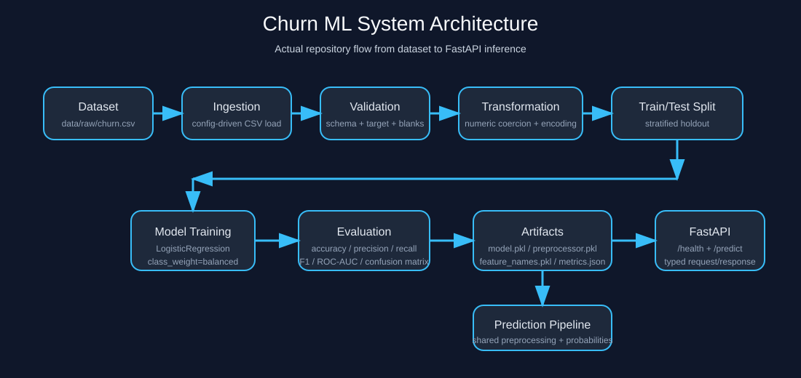
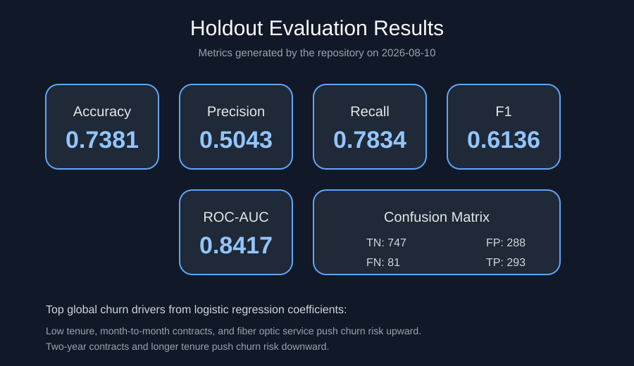

# Churn ML System

End-to-end churn prediction system with a reproducible scikit-learn training pipeline and a FastAPI inference API.

## Problem

Subscription businesses lose revenue when customers cancel unexpectedly. This project predicts churn risk from customer account, service, and billing attributes so a team can prioritize retention outreach for the highest-risk accounts.

## Solution

The repository trains a logistic regression model on the Telco churn dataset, saves the fitted preprocessor and model artifacts, and serves real-time predictions through FastAPI. Inference uses the same saved preprocessing artifact as training, so API consumers do not need to manually encode or scale inputs.

Business flow:

```text
Customer profile
    -> churn probability
    -> risk level
    -> retention follow-up
```

## Architecture



The implemented repository flow is:

```text
Dataset -> Ingestion -> Validation -> Transformation -> Train/Test Split
       -> Model Training -> Evaluation -> Saved Artifacts
       -> Prediction Pipeline -> FastAPI
```

## ML Pipeline

1. `DataIngestion` loads `data/raw/churn.csv` from `config/config.yaml`.
2. `DataValidation` checks required columns, target values, binary fields, numeric coercion, and blank `TotalCharges`.
3. `DataTransformation` drops `customerID`, coerces `TotalCharges`, scales numeric features, and one-hot encodes categorical features.
4. `train_pipeline.py` performs a stratified train/test split.
5. `ModelTrainer` fits `LogisticRegression(class_weight="balanced")`.
6. `ModelEvaluator` writes real holdout metrics to `artifacts/metrics.json`.
7. `PredictPipeline` loads `model.pkl`, `preprocessor.pkl`, and `feature_names.pkl` for API inference.

## Model

- Model: `LogisticRegression`
- Target: `Churn`
- Training strategy: stratified 80/20 train/test split
- Preprocessing: `ColumnTransformer(StandardScaler + OneHotEncoder(handle_unknown="ignore"))`

Core input features:

- Demographics: `gender`, `SeniorCitizen`, `Partner`, `Dependents`
- Account history: `tenure`, `Contract`, `PaperlessBilling`, `PaymentMethod`
- Services: `InternetService`, `OnlineSecurity`, `OnlineBackup`, `TechSupport`, `StreamingTV`, `StreamingMovies`
- Billing: `MonthlyCharges`, `TotalCharges`

### Actual Results

These metrics were generated by running `python -m src.pipeline.train_pipeline` on the repository dataset:

| Metric | Value |
| --- | ---: |
| Accuracy | 0.7381 |
| Precision | 0.5043 |
| Recall | 0.7834 |
| F1 | 0.6136 |
| ROC-AUC | 0.8417 |

Confusion matrix:

```text
TN=747  FP=288
FN=81   TP=293
```

Portfolio visual:



Interpretation:

- The model is tuned toward recall, which is useful when missing churners is costly.
- The strongest learned churn signals are low tenure, month-to-month contracts, and fiber optic service.
- Two-year contracts and longer tenure reduce churn risk.

## API

Run the API locally:

```bash
python -m uvicorn app:app --host 127.0.0.1 --port 8000
```

Available endpoints:

- `GET /`
- `GET /health`
- `POST /predict`
- `GET /docs`
- `GET /openapi.json`

### Request Example

```json
{
  "gender": "Female",
  "SeniorCitizen": 0,
  "Partner": "Yes",
  "Dependents": "No",
  "tenure": 12,
  "PhoneService": "Yes",
  "MultipleLines": "No",
  "InternetService": "DSL",
  "OnlineSecurity": "No",
  "OnlineBackup": "Yes",
  "DeviceProtection": "No",
  "TechSupport": "No",
  "StreamingTV": "No",
  "StreamingMovies": "No",
  "Contract": "Month-to-month",
  "PaperlessBilling": "Yes",
  "PaymentMethod": "Electronic check",
  "MonthlyCharges": 29.85,
  "TotalCharges": 653.4
}
```

### Response Example

This response was produced by the running API:

```json
{
  "churn_prediction": "Yes",
  "churn_probability": 0.7235,
  "risk_level": "high",
  "top_drivers": [
    {
      "feature": "num__tenure",
      "contribution": 0.962,
      "direction": "increase"
    },
    {
      "feature": "num__MonthlyCharges",
      "contribution": 0.787,
      "direction": "increase"
    },
    {
      "feature": "cat__Contract_Month-to-month",
      "contribution": 0.6511,
      "direction": "increase"
    }
  ]
}
```

### Error Handling

- Invalid request schema returns `422 Unprocessable Entity`
- Missing model artifacts returns `503 Service Unavailable`
- Unexpected inference failures return `500 Internal Server Error`

## Project Structure

```text
churn-ml-system/
├── app.py
├── config/
│   └── config.yaml
├── data/
│   └── raw/churn.csv
├── docs/
│   └── assets/
├── src/
│   ├── components/
│   ├── pipeline/
│   └── utils/
├── tests/
├── .env.example
├── render.yaml
├── Procfile
└── requirements.txt
```

## Installation

Python 3.11 is the verified runtime for this repository.

```bash
git clone <repository-url>
cd churn-ml-system
python -m venv .venv
.\.venv\Scripts\activate
python -m pip install -r requirements.txt
```

Environment variables are optional for local runs:

```bash
copy .env.example .env
```

Supported variables:

- `CHURN_CONFIG_PATH`
- `CHURN_ARTIFACT_DIR`
- `CHURN_LOG_LEVEL`

## Training

Generate fresh artifacts:

```bash
python -m src.pipeline.train_pipeline
```

Generated files:

- `artifacts/model.pkl`
- `artifacts/preprocessor.pkl`
- `artifacts/feature_names.pkl`
- `artifacts/metrics.json`
- `artifacts/validation_report.json`

## Running the API

For local development:

```bash
python -m uvicorn app:app --host 127.0.0.1 --port 8000
```

Open:

- Swagger UI: `http://127.0.0.1:8000/docs`
- OpenAPI schema: `http://127.0.0.1:8000/openapi.json`

## Prediction Example

PowerShell:

```powershell
$payload = @{
  gender = "Female"
  SeniorCitizen = 0
  Partner = "Yes"
  Dependents = "No"
  tenure = 12
  PhoneService = "Yes"
  MultipleLines = "No"
  InternetService = "DSL"
  OnlineSecurity = "No"
  OnlineBackup = "Yes"
  DeviceProtection = "No"
  TechSupport = "No"
  StreamingTV = "No"
  StreamingMovies = "No"
  Contract = "Month-to-month"
  PaperlessBilling = "Yes"
  PaymentMethod = "Electronic check"
  MonthlyCharges = 29.85
  TotalCharges = 653.4
} | ConvertTo-Json

Invoke-RestMethod -Uri "http://127.0.0.1:8000/predict" `
  -Method Post `
  -ContentType "application/json" `
  -Body $payload
```

## Tests

Run the automated checks:

```bash
python -m pytest
```

The suite covers:

- data validation behavior
- training artifact generation
- prediction pipeline behavior
- FastAPI health and prediction endpoints
- missing artifacts and invalid request handling

## Deployment

### Render

The repo includes `render.yaml` and `Procfile` for Render deployment.

- Build command: `pip install -r requirements.txt`
- Start command: `gunicorn app:app -k uvicorn.workers.UvicornWorker --bind 0.0.0.0:$PORT`

Note: `gunicorn` is intended for Linux deployment targets such as Render. Use `uvicorn` locally on Windows.

Before deploying, train the model locally and commit the artifacts, or set up a build hook to train on deployment:

```yaml
# Add to render.yaml under service
buildCommand: pip install -r requirements.txt && python -m src.pipeline.train_pipeline
```

### Docker Deployment

The project includes Docker support for containerized deployment:

```bash
docker-compose up -d
```

For production deployments, consider:
- Using a production-grade WSGI server configuration
- Setting up persistent volume for artifacts
- Configuring health checks and restart policies
- Setting appropriate resource limits

## Continuous Integration

The project uses GitHub Actions for automated testing:

- **Tests**: Runs pytest on push/PR
- **Training verification**: Ensures training pipeline completes successfully
- **Docker build**: Verifies Docker image builds correctly
- **Linting**: Basic code quality checks with ruff

View workflow status: `.github/workflows/ci.yml`

## Docker

Run the application in a Docker container:

### Build and run with Docker Compose

```bash
docker-compose up --build
```

The API will be available at `http://localhost:8000`.

### Build and run manually

```bash
# Build the image
docker build -t churn-ml-system .

# Run the container
docker run -p 8000:8000 \
  -v ${PWD}/artifacts:/app/artifacts \
  -v ${PWD}/data:/app/data \
  churn-ml-system
```

### Train the model in Docker

```bash
docker-compose run --rm churn-api python -m src.pipeline.train_pipeline
```

The artifacts will be persisted in the mounted `./artifacts` directory.

## Limitations

- The project trains a single baseline model rather than a model comparison suite.
- Validation focuses on schema and basic data quality checks, not drift detection.
- Explanations are coefficient-based driver summaries from logistic regression, not local SHAP-style explanations.
- Artifact versioning is file-based rather than registry-based.

## Future Improvements

- Add a small model comparison experiment while keeping the inference contract unchanged.
- Add threshold tuning tied to a business cost trade-off.
- Add versioned artifact metadata for easier promotion between environments.
- Add data drift monitoring for production deployments.
- Integrate SHAP or LIME for local instance-level explanations.

## Development Workflow

### Local Development

1. Clone and install dependencies
2. Train the model: `python -m src.pipeline.train_pipeline`
3. Run tests: `python -m pytest`
4. Start the API: `python -m uvicorn app:app --reload`

### Docker Development

1. Build and start: `docker-compose up --build`
2. Train in container: `docker-compose run --rm churn-api python -m src.pipeline.train_pipeline`
3. View logs: `docker-compose logs -f`
4. Stop: `docker-compose down`

### Pre-commit Checks

Before committing, verify:
```bash
python -m pytest                    # Run tests
python -m src.pipeline.train_pipeline  # Verify training works
ruff check .                        # Check code quality (optional)
```

## Portfolio Presentation

Suggested repo visuals:

1. Architecture: `docs/assets/architecture.svg`
2. Training results: `docs/assets/training-results.svg`
3. Swagger UI walkthrough: `docs/assets/swagger-ui.svg`
4. Prediction response: `docs/assets/prediction-response.svg`

## License

This project is licensed under the terms in `LICENSE`.

